## 引言

工欲善其事，必先利其器。

软件工程越来越复杂，一定要依赖现代化的方式，帮助我们快速定位，分析问题。

这里我们从日志相关3大功能，log、minidump和performance展开，讲述如何在Qt中使用Sentry在线收集日志


## 关于Sentry

Sentry平台，从简单的说是一个在线日志收集平台。从复杂说的可以帮我们处理从bug发生、定位、源码追溯、bug管理、修复、追踪，甚至是关联git和ci等一系列复杂流程。

使用Sentry是为了帮助我们从繁琐、复杂的日志收集工作中解放出来，提升开发效率。同时Sentry几乎支持全平台全语言，也提供http接口方便各类框架接入，保证了扩展性和适用性。

如果希望更深入了解Sentry，可以直接访问Sentry官网：
https://sentry.io/welcome/

Sentry是一个开源平台，可以通过docker部署Sentry到本地离线环境，或者到自己的公网服务器。

如果不想自己部署，也可以直接使用在线版的Sentry，但是这个针对不同使用量收费不同，也有一些限制。自己部署则完全免费也无功能限制。初次使用推荐到Sentry官网注册，全程操作不到5分钟即可完成。

Sentry已经提供了C++ SDK，如果想直接使用Sentry提供的C++ SDK，可以参考：https://docs.sentry.io/platforms/native/

而为什么我没有用Sentry的C++ SDK，反而自己开发了一个JQSentry。因为如果你看到这里了，想必你已经有了Qt环境了，而Qt又自己的网络系统（QNetwork），自己的日志系统（QDebug），使用这些已经足够和Sentry通过HTTP直接对接。考虑到C++各种abi问题和平台兼容问题，没有必要再拖一个额外的C++库，增加不确定性。

另外JQSentry和Qt深度结合，可以在全局捕获日志，使用也更为方便。


## 关于JQSentry

JQSentry基于Sentry的HTTP接口封装而来，目前一共有3个功能

* 日志数据收集，对应Sentry中Issues模块

* minidump数据收集，对应Sentry中Issues模块

* performance数据收集，对应Sentry中Performance模块

为了保证使用足够轻量级，方便嵌入到各种系统中。JQSentry已经封装在一个cpp和几个h文件中，并且只依赖Qt库。

理论上可以部署到 Qt5 & C++11 的所有环境中。

本库源码均已开源在了GitHub上。

GitHub地址：https://github.com/188080501/JQSentry

方便的话，帮我点个星星，或者反馈一下使用意见，这是对我莫大的帮助。

若你遇到问题、有了更好的建议或者想要一些新功能，都可以直接在GitHub上提交Issues：https://github.com/188080501/JQSentry/issues

如果需要扩展JQSentry，增加新数据或者模块，可以参考以下官网文档：

* 日志数据：https://docs.sentry.io/api/events/retrieve-the-latest-event-for-an-issue/

* minidump数据：https://docs.sentry.io/platforms/native/guides/minidumps/

* performance数据：https://develop.sentry.dev/sdk/envelopes/ & https://docs.sentry.io/product/performance/getting-started/


## Sentry的注册和基本使用

如果你已经注册了Sentry，或者已经有了自己的Sentry环境，可以跳过这一步

* 注册帐号

    这里都是标准步骤了，下一步下一步就行

    https://sentry.io/signup/

    > 注：这里貌似不能使用QQ邮箱

    > 注：有一个欢迎界面，如果不需要看教程可以直接点右下角的 ```Skip this onboarding```，如下图

    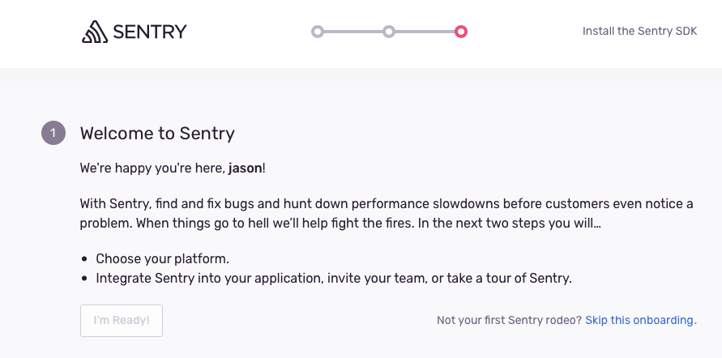

* 主界面

    主界面如下图，左侧tab都是对应相应的模块和功能。Sentry可以创建多个项目，方便管理。我这里已经创建好了一个项目，分类是Native，名字是jason-vt。这里名字是全局唯一的，因此如果有其他人用过这个项目名字了，会自动加上一个尾缀以防重复，例如我这边的 ```-vx```

    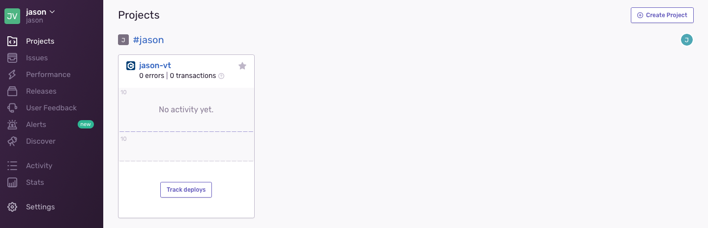

* Issues界面

    这里是显示log和minidump信息的主要界面，如果没有上传过任何数据，显示如下图：

    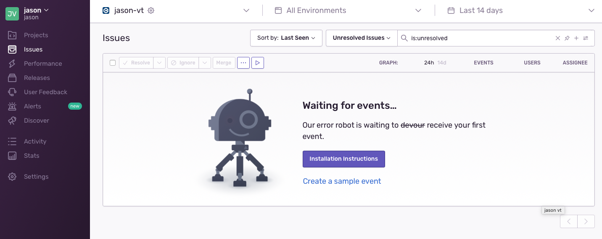

* Performance界面

    这里是显示性能数据和链路追踪的主要界面，如果没有上传过任何信息，显示如下图：

    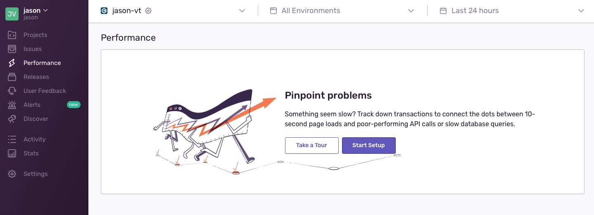

* 获取DSN

    DSN就相当于一个key，和项目绑定。有了DSN才可以上传数据到对应的项目中。

    请勿对外泄漏DSN，本Demo中DSN为测试使用，请替换成你自己项目实际DSN。

    具体获取DSN的路径如下：

    * 打开Settings

    * 打开Projects

    * 找到自己的项目，并打开

        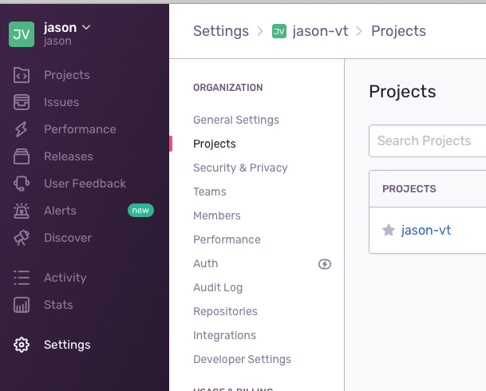

    * 打开 Client Keys(DSN)

    * 复制DSN中的字符串，黏贴至自己软件工程（非Sentry平台）相应配置中

        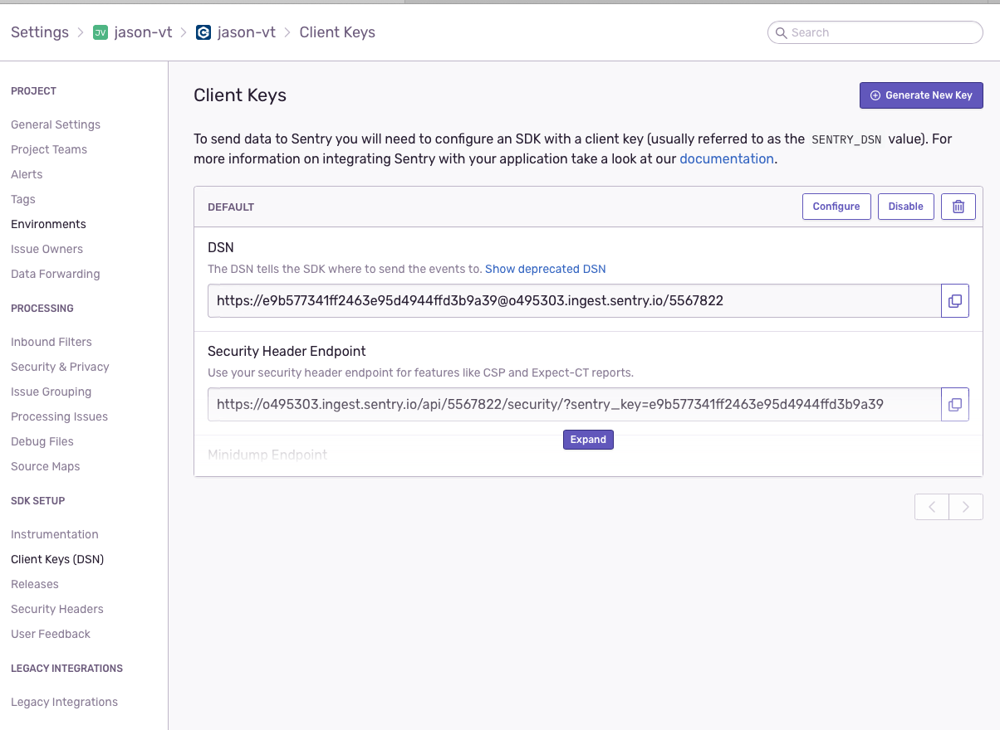


## 使用JQSentry

### 上传log

只需要2步即可完成一个log上传

* 初始化模块，并设置DSN

    ```
    JQSentry::initialize( "https://key@o495303.ingest.sentry.io/123456" );
    ```

* 上传

    ```
    JQSentry::postLog( "This is a debug" );
    ```

* 查看数据

    运行Demo中的PostLogDemo工程，在Sentry的Issues界面中可以看到如下数据

    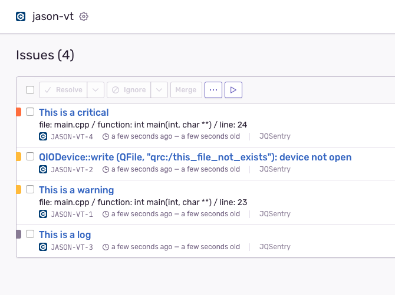

    打开日志后，可以看到详细信息。

    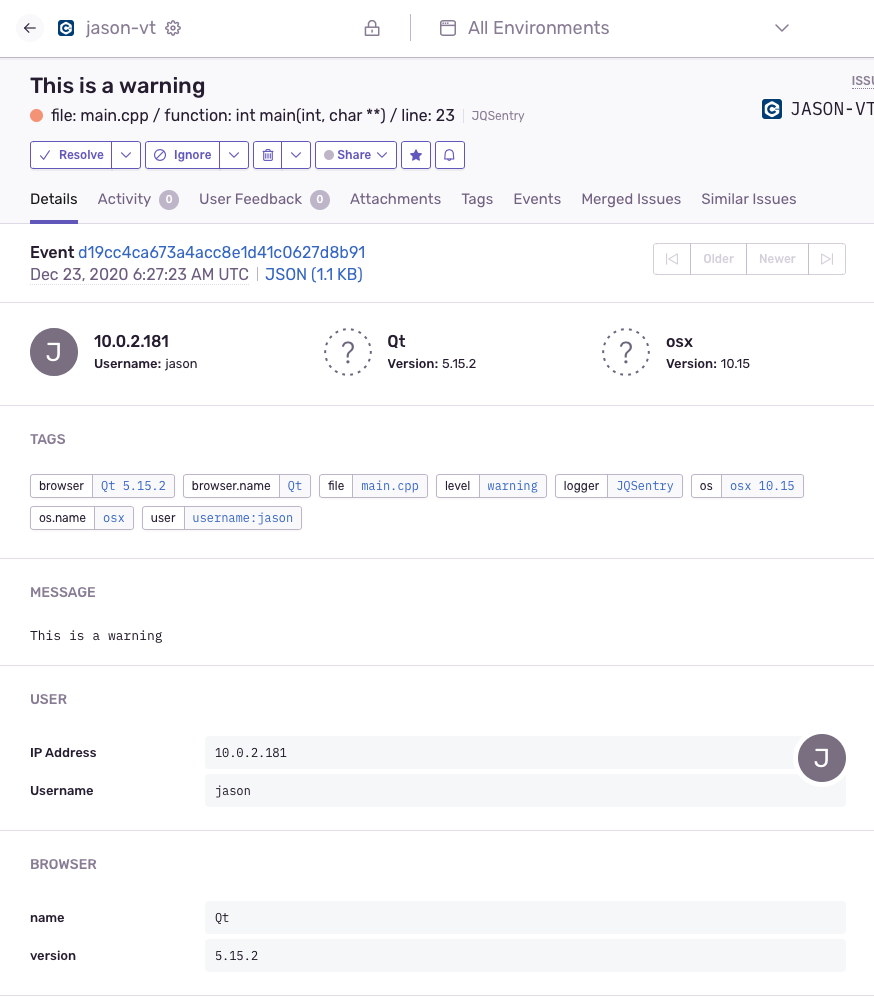

    JQSentry已经收集了一些基本信息，包括：

    * 发生时间

    * 打印log的文件、函数、行信息（需要使用QDebug系统才有）

    * Qt版本（显示为浏览器，请忽略这个问题）

    * 系统信息

    * IP信息

    如果需要额外信息，例如发布版本号，或者自定义的tag，可自行添加

### 上传minidump

和上传log一样，需要先初始化，再上传minidump

这里需要注意的是，JQSentry不负责minidump原始文件的收集。

因为minidump文件收集是一个大概念，比较复杂，而且不同平台处理不一样，因此暂时没计划集成到JQSentry中

minidump文件收集需要使用OS API，例如Windows下可以使用```SetUnhandledExceptionFilter```

Demo中的dmp文件是我提前从其他程序中收集好的，仅供测试。

* 上传

    ```
    QFile minidumpFile( ":/test.dmp" );
    minidumpFile.open( QIODevice::ReadOnly );

    JQSentry::postMinidump(
        "This is a minidump",
        "test",
        minidumpFile.readAll() );
    ```

* 查看数据

    运行Demo中的PostMinidumpDemo工程，在Sentry的Issues界面中可以看到如下数据

    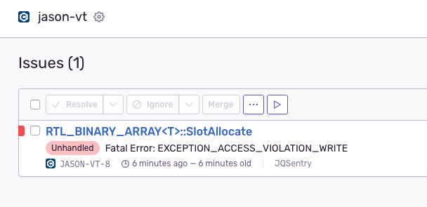

    打开后，可以看到详细信息

    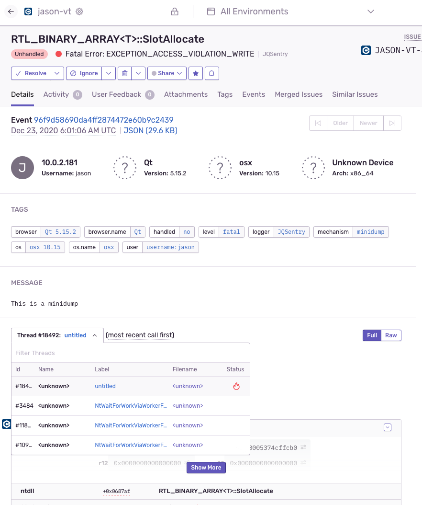

    在只上传minidump的情况下，Sentry已经可以分析错误的类型，崩溃的模块等大致信息

    如果附带PDB，则可以定位到源码级别，甚至是关联到对应到git记录。但是PDB因为文件体积，安全性等原因，一般不上传。

    如果需要进一步调试，可以下载minidump文件到本地，通过VS等工具进一步调试。在页面最下方可以下载。

    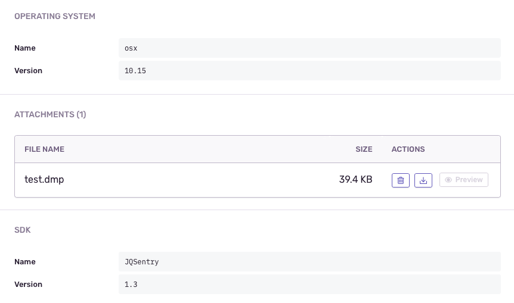

### 上传performance

和上传log一样，需要先初始化，再上传performance

* 上传

    ```
    void something()
    {
        // 通过手动方式生成span，生命周期结束后就会自动上传数据
        // 指定parent的span，生命周期结束后，会写入结果数据到root span中，等待root span生命周期结束后一起上传
        // 结果数据包括创建span是指定的operationName、description、span创建时间和span销毁时间

        // 可以附带数据，方便调试
        QJsonObject data;

        data[ "key" ]   = "mykey1";
        data[ "value" ] = "myvalue1";

        auto rootSpan = JQSentrySpan::create( "WorkResult", "saveToFile", data );

        QThread::msleep( 20 ); // 模拟耗时操作

        for ( auto index = 0; index < 3; ++index )
        {
            auto readyDataSpan = JQSentrySpan::create( rootSpan, "DataProvider", "readyData" );

            QThread::msleep( 20 );

            if ( index == 1 )
            {
                // 不需要上传时可以cancel
                readyDataSpan->cancel();
            }
        }

        {
            auto saveStep1Span = JQSentrySpan::create( rootSpan, "DataSaver", "saveStep1" );

            QThread::msleep( 5 );

            {
                // 可以不指定description
                auto saveStep2Span = JQSentrySpan::create( saveStep1Span, "DataSaver" );

                QThread::msleep( 10 );

                {
                    // 也可以提前释放span
                    saveStep1Span.clear();

                    auto saveStep3Span = JQSentrySpan::create( saveStep2Span, "DataSaver", "saveStep3" );

                    // 指定status，具体可以填写哪些值，请参考HTTP的status，不可以自定义
                    saveStep3Span->setStatus( "internal_error" );

                    QThread::msleep( 50 );
                }
            }
        }

        {
            auto cleanSpan = JQSentrySpan::create( rootSpan, "WorkResult", "cleanBuffer", data );

            QThread::msleep( 10 );
        }

        QThread::msleep( 5 );
    }
    ```

* 查看数据

    运行Demo中的PostMinidumpDemo工程，在Sentry的Performance界面中可以看到如下数据

    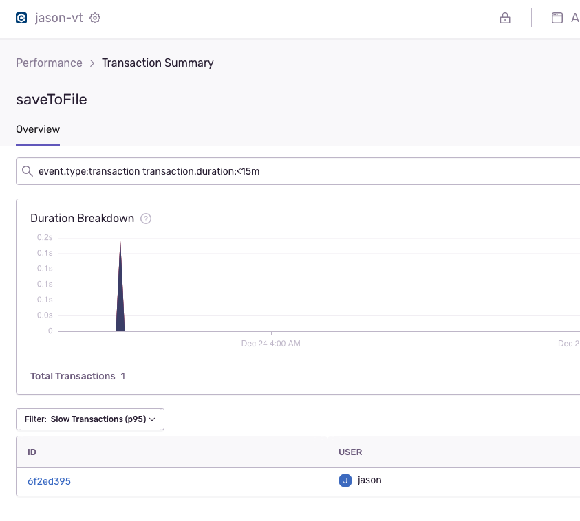

    注意这里Filter是可选的，默认是按照耗时来排序，可以根据自己需求选择

    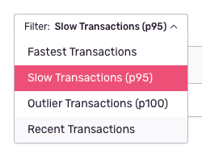

    根据ID，可以定位到具体到一组Span，这里总耗时就是之前代码中root span的生命周期

    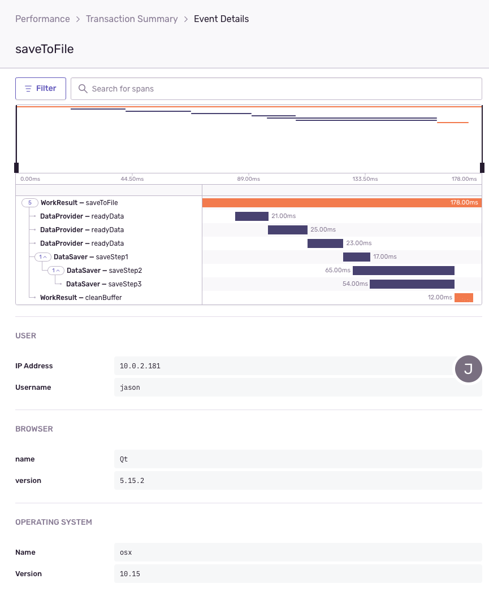


## Sentry局限性

* 事件延迟

    虽然Sentry是在线日志收集系统，但是不代表post完后数据可以立即刷新出来。一般的log可能有几秒到几十秒延迟，minidump和performance可能有几十秒甚至几分钟级别延迟。追求低延迟可以考虑自己部署Sentry。我自己部署到本地的Sentry，延迟就明显比官方在线版本的低。

* 网络可用性

    官方在线版本Sentry的服务器，毕竟是部署在国外，没有代理加速的话打开会很慢，极端情况下还会丢数据（上传失败）。如果要追求高可用性，建议还是自己部署Sentry。

* 性能

    和那些每秒万级别，几十万级别的日志系统不同。Sentry这边处理速度明显要慢很多。我自己部署的Sentry，用的8代i7 CPU，16G内存，SSD硬盘。对事件处理速度峰值也在几百每秒，再高的话就处理不过来了。当然这个问题可以通过加CPU、加内存、加硬盘解决。但是说到底Sentry性能还是受限，对于大并发量的log，建议还是通过文件方式存储在本地。
